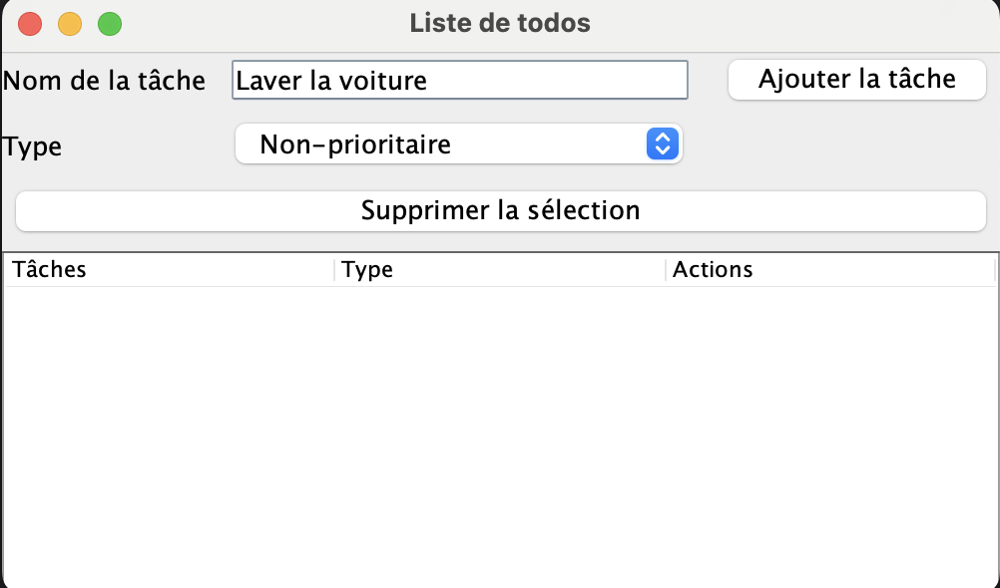
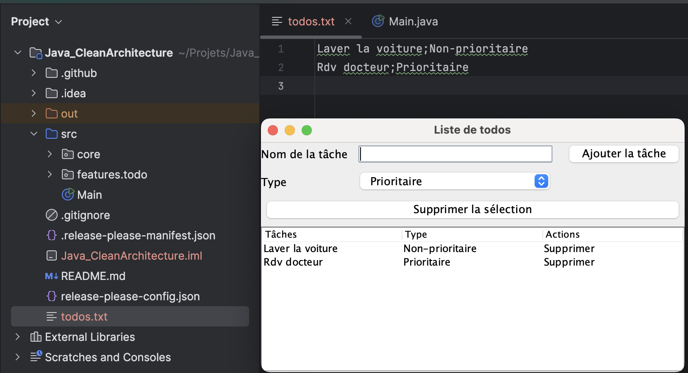
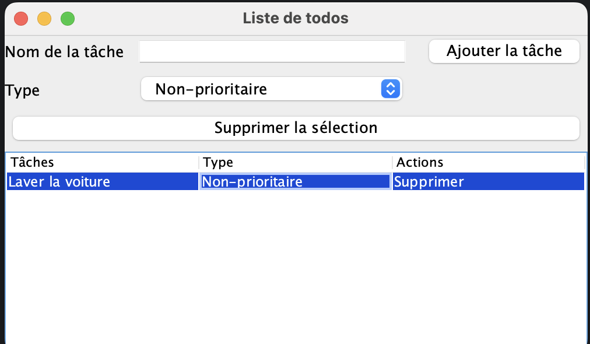

# 🧼 Clean Architecture en Java – Application Todo List

Ce projet est une **démonstration pédagogique** de la **Clean Architecture** en Java pur, sans framework. Il s'agit d'une application de gestion de tâches (Todo List) dont les données sont **persistées dans un fichier local**. L'objectif est de montrer comment organiser un projet Java de façon claire, évolutive et testable.

---

## 📝 Prérequis

### Prérequis techniques
- **Bases en Java** : savoir ce qu'est une classe, interface, une méthode, un package
- **Java 17** ou supérieur (compilation et exécution)
- Un IDE Java (IntelliJ, Eclipse, VSCode...)
- Savoir compiler et exécuter un projet Java simple
- Aucune dépendance externe requise (pas de Maven/Gradle nécessaire)
---

## 🎯 Objectif pédagogique

- Comprendre la séparation des responsabilités dans une application
- Ajouter de nouvelles tâches avec un type (Prioritaire, Non-prioritaire, Personnel, Travail)
- Supprimer des tâches
- Observer comment chaque couche (UI, domaine, données) interagit
- Voir comment la persistance fonctionne sans base de données ni librairie externe

---

## 📚 Qu'est-ce que la Clean Architecture ?

La Clean Architecture vise à organiser le code en **couches indépendantes**. Chaque couche a une **responsabilité bien définie** et dépend uniquement des couches **plus internes** (jamais des couches externes). Cela permet de :
- Faciliter les tests unitaires
- Rendre le code évolutif (changer la persistance, l'UI, etc.)
- Mieux comprendre et maintenir le projet

### 📁 Structure réelle du projet :
```
/src
├───core
│    └───DI.java
├───features
│   └───todo
│       ├───data
│       │    ├───datasource
│       │    ├───model
│       │    └───repository
│       ├───domain
│       │    ├───entity
│       │    ├───repository
│       │    └───usecase
│       └───presentation
│            ├───controller
│            ├───view
```

---

## 🧩 Explication pédagogique des couches

### 🟢 Présentation (`features/todo/presentation`)
**Rôle :** Interface utilisateur (Swing) et gestion des actions utilisateur.
- **view/** : Affiche la fenêtre, la liste, la comboBox, les boutons. Ex : `TodoPage.java`.
- **controller/** : Reçoit les actions de la vue (ajouter/supprimer), fait le lien avec le domain.

> **Exemple :** Quand on clique sur "Ajouter la tâche", la vue appelle le contrôleur, qui transmet la demande à la couche domaine.

### 🔹 Domaine (`features/todo/domain`)
**Rôle :** Logique métier pure, indépendante de l'UI ou de la persistance.
- **entity/** : Décrit ce qu'est une tâche (`TodoItem` : nom + type)
- **repository/** : Définit ce qu'un dépôt de tâches doit savoir faire (ajouter, supprimer, lister)
- **usecase/** : Cas d'usage métier (ajouter une tâche, supprimer une tâche)

> **Exemple :** Le contrôleur appelle le usecase "ajouter une tâche", qui crée un objet `TodoItem` et demande au repository de le sauvegarder.

### 🔸 Données (`features/todo/data`)
**Rôle :** Gère la persistance (ici, dans un fichier texte local)
- **model/** : Représente la tâche telle qu'elle est stockée dans le fichier (`TodoItemModel`)
- **datasource/** : Lit/écrit les tâches dans le fichier texte (`FileDataSource`)
- **repository/** : Convertit entre le modèle de données et l'entité métier, et relie le domaine à la persistance

> **Exemple :** Le repository transforme un `TodoItem` en `TodoItemModel` pour l'enregistrer dans le fichier, et inversement pour la lecture.

### ⚙️ Core
- **core/DI.java** : Fait le "câblage" de toutes les couches (dépendances), pour que la vue reçoive un contrôleur déjà prêt à l'emploi.

---

## 🔄 Flux Clean Architecture (expliqué étape par étape)

1. **Lancement de l'application**
   - Le main crée la vue et le contrôleur via `DI.java`
   - La vue demande au contrôleur la liste des tâches à afficher
2. **Ajout d'une tâche**
   - L'utilisateur saisit un nom, choisit un type, clique sur "Ajouter la tâche"
   - La vue appelle le contrôleur, qui crée une entité `TodoItem` et la transmet au domaine
   - Le domaine demande au repository d'ajouter la tâche
   - Le repository convertit et sauvegarde la tâche dans le fichier
   - La vue recharge la liste
3. **Suppression d'une tâche**
   - L'utilisateur clique sur "Supprimer" à côté d'une tâche
   - La vue appelle le contrôleur, qui demande au domaine de supprimer la tâche
   - Le repository met à jour le fichier
   - La vue recharge la liste

---

## 🖼️ Aperçu de l'application

### Interface principale

*Fenêtre principale de l'application avec la liste des tâches, la zone de saisie, la comboBox pour le type et les boutons d'action.*

### Ajout d'une tâche

*Exemple d'ajout d'une tâche avec sélection du type "Prioritaire".*

### Suppression d'une tâche

*Suppression d'une tâche via le bouton "Supprimer" dans la colonne Actions.*

---

## ✅ Avantages pédagogiques de cette Architecture

- **Séparation des responsabilités** : chaque couche a un rôle clair
- **Testabilité accrue** : la logique métier peut être testée sans l'UI
- **Évolutivité** : on peut changer la persistance ou l'UI sans toucher au domaine
- **Lisibilité et maintenabilité** : le code est organisé, facile à comprendre et à faire évoluer

---

## 📝 Auteur

Projet écrit par **Pellicane Alessio** pour illustrer les principes de la Clean Architecture avec un exemple simple, pédagogique et sans dépendances externes.

---
